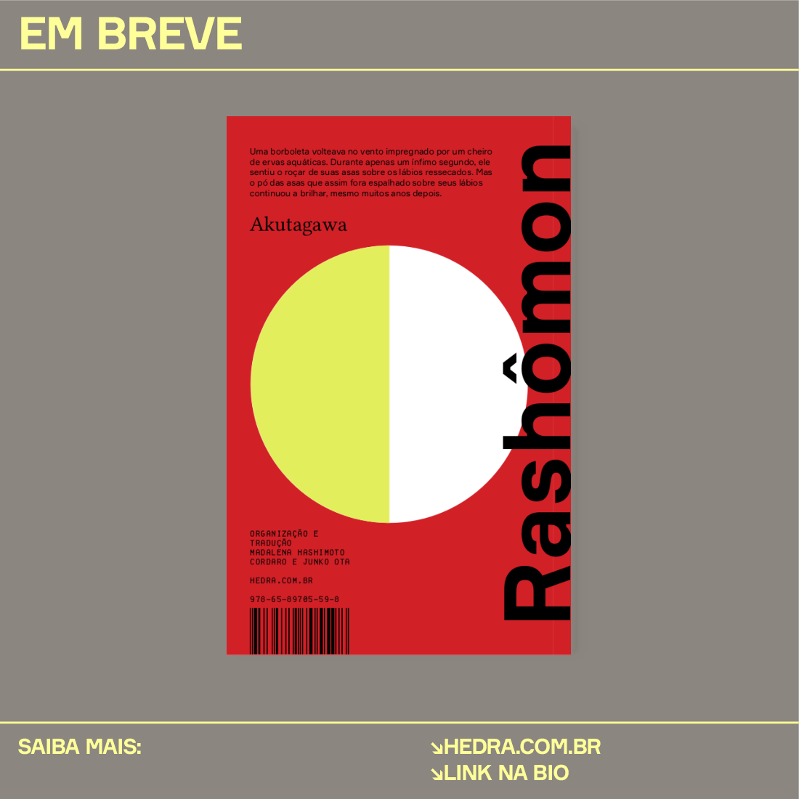

# Build para ConText

Instale os arquivos `context.sublime-build` e `context-once.sublime-build` na pasta `~/.config/sublibe-text/Packages/User`.
Ou utilize o Makefile para isso rodando `make sublime`. (Não sei se funciona no mac.) 


# Para instalar novas fontes conTeXt:

Atualizar a pasta `~/.fonts` e depois executar os seguintes comandos:

```
export OSFONTDIR=$HOME/.fonts:/usr/share/fonts
mtxrun --generate
mtxrun --script font --reload
```

# Para gerar pasta com imagens

```sh
# Sem extensão (.tex)
make file=NOME_DO_ARQUIVO
```

# Snippets

```
cd snippets
make 
```

## Utilização

Apra um arquivo .tex vazio e digite `EdLab-tempaltes-marketing` 


# Instruções

```
% Comandos & Instruções %%%%%%%%%%%%%%%%%%%%%%%%%%%%%%%%%%%%%%%%%%%%%%%%%%%%%%%%%%%%%%%|

% Cabeço e rodabé: Informações (caso queira trocar alguma coisa)
%       \def\MensagemSaibaMais{SAIBA MAIS:}
%       \def\MensagemSite{HEDRA.COM.BR}
%       \def\MensagemLink{LINK NA BIO}

% Pesos para os títulos:
%       \startMyCampaign...      \stopMyCampaign
%       \stopMyCampaignSection...   \stopMyCampaignSection

% Aplicação de imagens: 
%       \MyCover{capa.pdf}      % Aplicação de capa de livro com sombra
%       \MyPicture{Imagem.png}  % Imagem com aplicação de filtro segundo cor MyColorText
%       \MyPhoto{}              % Aplicação simples de imagem com tamamho \textwidth

% Aplicação de imagem com legenda:      
%       \placefigure{Legenda}{\externalfigure[drop2-1.png][width=\textwidth]}

% Cabeço e rodabé: Opções
%       \Mensagem{AGORA É QUE SÃO ELAS}
%       \Hashtag{campanha de natal}
%       \Mensagem{campanha de natal}

% Alteração de várias cores de background:
% \setupbackgrounds[page][background=color,backgroundcolor=MyGray]

% Estrela: 
% \vfill\scale[lines=2]{\MyStar[black][none]}                   % Estrela pequena  
% \startpositioning                                             % Estrela grande
%  \position(-1,-.3){\scale[scale=980]{\MyStar[white][none]}}
% \stoppositioning

% Logos e selos:                
% \Hedra
% \HedraAyllon  % Não está pronto
% \HedraAcorde  % Não está pronto
% \Ayllon       % Não está pronto
% \Acorde       % Não está pronto

% Atalhos:                      
%       \Seta  % Seta para baixo

%%%%%%%%%%%%%%%%%%%%%%%%%%%%%%%%%%%%%%%%%%%%%%%%%%%%%%%%%%%%%%%%%%%%%%%%%%%%%%%%%%%%%%%|
```


# Padrão de nomes


```sh
AUTOR_LIVRO_<EDITORIA>.tex
AUTOR_LIVRO_<EDITORIA>_THUMB.jpg # capa
AUTOR_LIVRO_<EDITORIA>-1.jpg	 # imagem 1
AUTOR_LIVRO_<EDITORIA>-2.jpg	 # imagem 2
```

# Editorias

```sh
> Institucional
> "A EDITORA"
> AUTOR_LIVRO_INSTITUCIONAL.tex

```


### AUTOR_LIVRO_AUTOR.tex
> quem é "autor"
> "VIDA & OBRA"
> 


### AUTOR_LIVRO_CLIPPING.tex
> imprensa "clipping"
> "NA IMPRENSA"


### AUTOR_LIVRO_CURIOSIDADE.tex
> Vamos falar sobre isso "curiosidades"
> "EM CONTEXTO"


### AUTOR_LIVRO_DETALHE.tex
> detalhes da edição ou por dentro da edição
> "POR DENTRO DA EDIÇÃO"


### AUTOR_LIVRO_EVENTO.tex
> Evento
> "EVENTO"


### AUTOR_LIVRO_LANÇAMENTO.tex
> Lançamento
> "EM BREVE"
> 


### AUTOR_LIVRO_PREVENDA.tex
> Pré-venda
> "PRÉ-VENDA"


### AUTOR_LIVRO_TRECHO.tex
> destaques "um trecho do livro:"
> "OP.CIT."


## Onde subir os arquivos

[Google Drive Mayara](https://drive.google.com/drive/u/4/folders/1etqbv6Ow5HCGbJ6AdRz2QPFBKKe26zCj)
